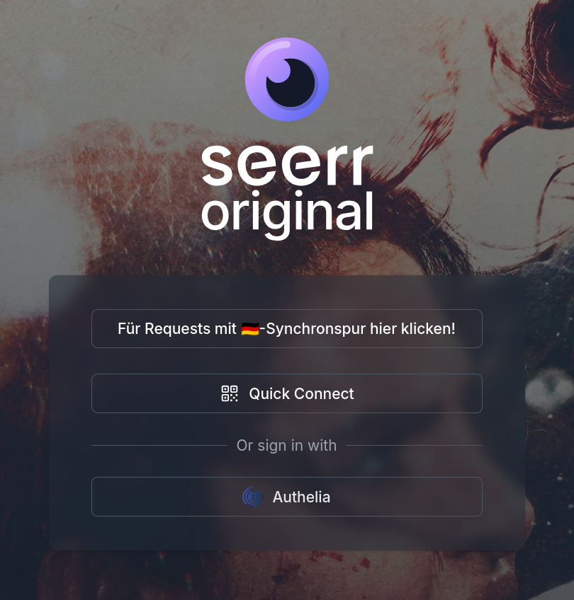
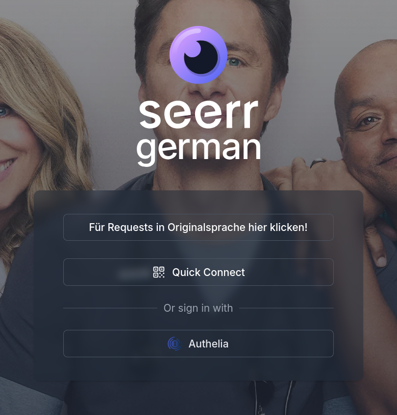
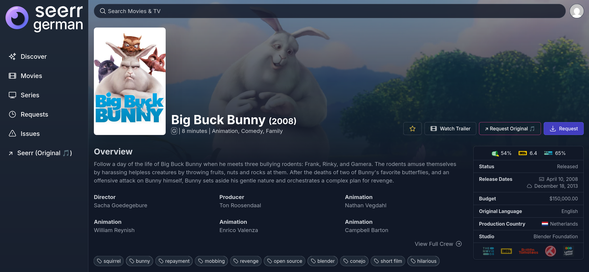
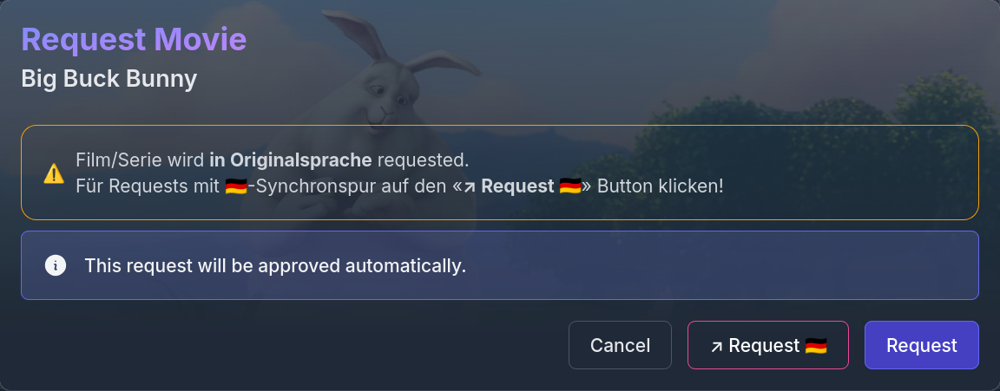
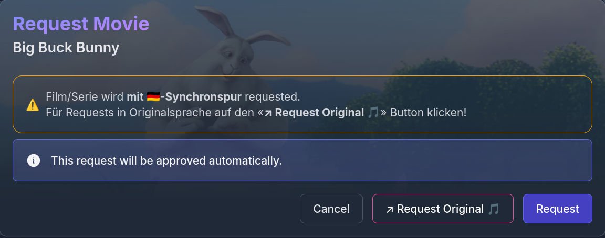

:::note
This guide shows how to *visually connect* multiple Seerr instances to handle multiple requests for the same movie/series in different audio languages!  
The focus is on connecting two Seerr instances: **One** for requests in the **original language**, and one for **German-dubbed** releases.  
If you intend to use your Seerr instances for other languages, you will need to adjust the configuration.  
The modifications are **purely visual** – nothing is changed in the Seer codebase!  
These changes are made solely by **injecting CSS/JS** with the help of your NGINX reverse proxy :)
:::

## Introduction
As long as you and your friends are focusing on the original language of a movie or series, you might not have even thought about that issue.
I had the same experience: All my users were requesting movies and series in their original language, which could easily be handled by one Seer instance.
Recently, however, some new users have started requesting dubbed releases in German rather than the original language. This raises various problems:

1. **Only 1 request can be made**  
   It is not possible to make a request with several language profiles. As soon as User A requests a movie or series in OL, User B cannot request it a second time with a German language profile. This is also due to the Radarr/Sonarr limitation. They cannot handle multiple language versions of a movie or series. Furthermore, Seer does not allow more than one Radarr/Sonarr instance to be connected, except for a 4K server. However, this will not help with this specific setup.
2. **Manual interaction is needed**  
   As soon as User B wants to request a movie or series that has already been requested in OL, they cannot request it again in German Dubbed. They then need to report an issue or get in touch with me so that I can download the movie or series in their preferred language 
3. **DL (Dual Language) releases are not a general solution**  
   Yes, I could set the Radarr/Sonarr profile to German + OL, which would then prioritise DL releases with German and OL language tracks. However, the selection of releases with German dubbing is much smaller than releases with OL, and not everything is available with a German dubbing track anyway.

I therefore had to partially duplicate my setup: I **deployed a second Radarr, Sonarr and Seer** instance specifically for German dubbed requests.

However, I've noticed that this might confuse some of my friends. They might not understand which Seer instance they need to use for which language profile request.  
I've wanted to integrate these two Seer instances more closely.  
That's where the **sub_filter** functionality of **NGINX** comes into action.  
Using this, I was able to inject specific **buttons**, **links** and **info boxes** into the WebUI of Seerr.

## Preview
### Login Page
| Seerr Original | Seerr German |
|----------|----------|
|  |  |
### Movie Page
| Seerr Original | Seerr German |
|----------|----------|
|  |  |
### Request Modal
| Seerr Original | Seerr German |
|----------|----------|
|  |  |

### References
- **Seerr:** [github.com/seerr-team/seerr](https://github.com/seerr-team/seerr)
- **Radarr:** [github.com/Radarr/Radarr](https://github.com/Radarr/Radarr)
- **Sonarr:** [github.com/Sonarr/Sonarr](https://github.com/Sonarr/Sonarr)
- **NPM** (NginxProxyManager): [github.com/NginxProxyManager/nginx-proxy-manager](https://github.com/NginxProxyManager/nginx-proxy-manager) 

## Prerequisites
- **2 Seerr** instances (Docker deployment)
- **2 Radarr** instances
- **2 Sonarr** instances
- **NPM** (NGINX) reverse proxy in front of your Seerr instances

## Setup
### Seerr Original instance
Edit your NPM reverse proxy configuration for your **Seerr Original** instance
1. Got to *Custom Locations* and add a new Location:
   - **Location:** `\`
   - **Scheme:** `http`
   - **Forward Hostname / IP:** `seerr-original` (or whatever hostname/IP you've set)
   - **Forward Port**: `5055` (or whatever Port you've set)
2. Next, copy-paste this **NGINX configuration template** into your text editor:
   <details>
   <summary>Custom NGINX configuration</summary>

   ```
   # ---------------------------------------------------------
   # Disable upstream compression so sub_filter can work
   # ---------------------------------------------------------
   proxy_set_header Accept-Encoding "";

   # =============================================================
   # CSS INJECTION
   #
   # [1] Login page       - style for 2nd Seerr (German) button
   # =============================================================
   sub_filter '</head>' '<style>
   #second-seerr-btn {
      margin-bottom: 0.5rem !important;
      white-space: normal;
      line-height: 1.4;
   }
   </style></head>';

   # =============================================================
   # JS GROUP A">
   #
   # [3] seerrBtn() - 2nd Seerr (German) button on login page
   # =============================================================
   sub_filter '<div id="__next">' '<div id="__next"><script>
   (function() {
   var G = "https://YOUR-SEERR-GERMAN-INSTANCE.DOMAIN.TLD";


   // [3] seerrBtn - 2nd Seerr (German) button on login page
   function seerrBtn() {
      if (document.getElementById("second-seerr-btn")) return;
      var btns = document.querySelectorAll("button");
      var qcBtn = null;
      for (var i = 0; i < btns.length; i++) {
         if (/Quick\s*Connect/i.test(btns[i].textContent || "")) { qcBtn = btns[i]; break; }
      }
      if (!qcBtn) return;
      var wrapper = qcBtn.parentElement;
      if (!wrapper || !wrapper.parentNode) return;
      var btn = document.createElement("button");
      btn.id = "second-seerr-btn";
      btn.type = "button";
      btn.className = qcBtn.className;
      btn.textContent = "F\u00fcr Requests mit \uD83C\uDDE9\uD83C\uDDEA-Synchronspur hier klicken!";
      btn.onclick = function() { window.location.href = G + "/"; };
      wrapper.parentNode.insertBefore(btn, wrapper);
   }

   function run() { seerrBtn(); }
   new MutationObserver(run).observe(document.documentElement, { childList: true, subtree: true });
   var count = 0;
   var timer = setInterval(function() {
      run();
      var done = document.getElementById("second-seerr-btn");
      if (done || ++count > 80) clearInterval(timer);
   }, 200);
   })();
   </script>';

   # =============================================================
   # JS GROUP B — injected before </body>
   #
   # [1] reqBtn()   - Request (DE) button on movie/tv detail pages
   #                - Request (DE) button inside request modal
   # [2] warnBox()  - Amber warning box inside request modal
   # =============================================================
   sub_filter '</body>' '<script>
   (function() {
   var G = "https://YOUR-SEERR-GERMAN-INSTANCE.DOMAIN.TLD";

   // [1] reqBtn - Request (DE) button on media pages + inside request modal
   function reqBtn() {
      if (!document.getElementById("second-request-btn")) {
         var actions = document.querySelector(".media-actions");
         if (actions) {
         var z20 = actions.querySelector(".z-20");
         if (z20 && z20.parentNode) {
            var btn = document.createElement("button");
            btn.id = "second-request-btn";
            btn.type = "button";
            btn.className = "relative z-10 inline-flex h-full items-center px-4 py-2 text-sm font-medium leading-5 transition duration-150 ease-in-out hover:z-20 focus:z-20 focus:outline-none button-md text-white border bg-pink-600 border-pink-500 bg-opacity-80 hover:bg-opacity-100 hover:border-pink-500 active:bg-pink-700 active:border-pink-700 focus:ring-pink rounded-md ml-2";
            var sp = document.createElement("span");
            sp.textContent = "\u2197 Request \uD83C\uDDE9\uD83C\uDDEA";
            btn.appendChild(sp);
            btn.onclick = function() { window.location.href = G + window.location.pathname + window.location.search; };
            z20.parentNode.insertBefore(btn, z20.nextSibling);
         }
         }
      }
      if (!document.getElementById("modal-german-btn")) {
         var dialog = document.querySelector("[role=dialog]");
         if (dialog) {
         var btns = dialog.querySelectorAll("button");
         var source = null;
         for (var i = 0; i < btns.length; i++) {
            if (/^(Request|Select Season|Already Requested|Anfrage|Staffel)/i.test((btns[i].textContent || "").trim())) {
               source = btns[i]; break;
            }
         }
         if (source) {
            var mbtn = document.createElement("button");
            mbtn.id = "modal-german-btn";
            mbtn.type = "button";
            mbtn.className = source.className.replace(/indigo/g, "pink");
            mbtn.textContent = "\u2197 Request \uD83C\uDDE9\uD83C\uDDEA";
            mbtn.onclick = function() { window.location.href = G + window.location.pathname + window.location.search; };
            source.parentNode.insertBefore(mbtn, source.nextSibling);
         }
         }
      }
   }

   // [2] warnBox - amber warning box inside request modal
   function warnBox() {
      if (document.getElementById("orig-lang-warn")) return;
      var dialog = document.querySelector("[role=dialog]");
      if (!dialog) return;
      var nodes = dialog.querySelectorAll("p,span,div");
      var target = null;
      for (var i = 0; i < nodes.length; i++) {
         var el = nodes[i];
         if (el.childNodes.length === 1 && el.childNodes[0].nodeType === 3 &&
            /(approved automatically|automatisch genehmigt)/i.test(el.textContent)) {
         target = el; break;
         }
      }
      if (!target) return;
      var box = document.createElement("div");
      box.id = "orig-lang-warn";
      box.className = "mb-2 flex items-center gap-2 rounded-xl border border-amber-500 bg-amber-900 bg-opacity-50 p-4 text-amber-200 text-sm";
      box.innerHTML = "\u26a0\ufe0f <span>Film/Serie wird <strong>in Originalsprache</strong> requested.<br>F\u00fcr Requests mit \uD83C\uDDE9\uD83C\uDDEA-Synchronspur auf den «<strong>\u2197 Request \uD83C\uDDE9\uD83C\uDDEA</strong>» Button klicken!</span>";
      var wrap = target.closest("div.mb-6,div.p-4,form") || target.parentNode;
      wrap.parentNode.insertBefore(box, wrap);
   }

   function run() { reqBtn(); warnBox(); }
   new MutationObserver(run).observe(document.documentElement, { childList: true, subtree: true });
   var count = 0;
   var timer = setInterval(function() {
      run();
      if (document.getElementById("second-request-btn") || ++count > 80) clearInterval(timer);
   }, 200);
   })();
   </script></body>';

   # =============================================================
   # JS GROUP C
   #
   # [3] sbBtn() - Seerr (DE-Synchro) link at bottom of sidebar nav
   # =============================================================
   sub_filter '</html>' '<script>
   (function() {
   var G = "https://YOUR-SEERR-GERMAN-INSTANCE.DOMAIN.TLD";

   // [3] sbBtn - inject Seerr (DE-Synchro) at bottom of sidebar nav
   function sbBtn() {
      if (document.getElementById("s-g-b")) return;
      var nav = document.querySelector(".sidebar nav");
      if (!nav) return;
      var discover = nav.querySelector("a");
      if (!discover) return;
      var link = document.createElement("a");
      link.id = "s-g-b";
      link.href = G;
      link.className = "group flex items-center rounded-md px-2 py-2 text-lg font-medium leading-6 text-white transition duration-150 ease-in-out focus:outline-none bg-pink-700 hover:bg-pink-600";
      var icon = document.createTextNode("\u2197 ");
      var span = document.createElement("span");
      span.setAttribute("class", "ml-3");
      span.textContent = "Seerr (\uD83C\uDDE9\uD83C\uDDEA-Synchro)";
      link.appendChild(icon);
      link.appendChild(span);
      nav.appendChild(link);
   }

   new MutationObserver(sbBtn).observe(document.documentElement, { childList: true, subtree: true });
   var count = 0;
   var timer = setInterval(function() {
      sbBtn();
      if (document.getElementById("s-g-b") || ++count > 80) clearInterval(timer);
   }, 200);
   })();
   </script></html>';

   sub_filter_once on;
   ```

   </details>

   3. Configure the template to your needs. Preferably using **Find & Replace** (e.g. `CTRL+R`/`CTRL+F`) function of your text editor:
   - Adjust the URL of your **Seerr German** instance:
     ```
     https://YOUR-SEERR-GERMAN-INSTANCE.DOMAIN.TLD
     ```
   - Adjust the text of buttons **[↗ Request 🇩🇪]** (*optionally*)
     ```
     sp.textContent = "\u2197 Request \uD83C\uDDE9\uD83C\uDDEA";
     ```
     ```
     mbtn.textContent = "\u2197 Request \uD83C\uDDE9\uD83C\uDDEA";
     ```
   - Adjust the text of **warning box** (*optionally*)
     ```
     box.innerHTML = "\u26a0\ufe0f <span>Film/Serie wird <strong>in Originalsprache</strong> requested.<br>F\u00fcr Requests mit \uD83C\uDDE9\uD83C\uDDEA-Synchronspur auf den «<strong>\u2197 Request \uD83C\uDDE9\uD83C\uDDEA</strong>» Button klicken!</span>";
     ```
   - Adjust the text of sidebar navigation button **[Seerr (🇩🇪-Synchro)]** (*optionally*)
     ```
     span.textContent = "Seerr (\uD83C\uDDE9\uD83C\uDDEA-Synchro)";
     ```
   - Adjust the text of injected login page button **[Für Requests mit 🇩🇪-Synchronspur hier klicken!]** (*optionally*)
     ```
     btn.textContent = "F\u00fcr Requests mit \uD83C\uDDE9\uD83C\uDDEA-Synchronspur hier klicken!";
     ```
4. Use the *Cutom Location* gear Icon and add the configured NGINX configuration!

5. Additionally, you could also replace the **default Seerr logos**
   - Upload these logos to your seerr configuration directory (e.g. `/path/to/your/seerr-original/configuration/`)
      - [logo_full_original.svg](https://raw.githubusercontent.com/v3DJG6GL/wiki/refs/heads/master/src/assets/connecting_seerr_instances/logo_full_original.svg)
      - [logo_stacked_original.svg](https://raw.githubusercontent.com/v3DJG6GL/wiki/refs/heads/master/src/assets/connecting_seerr_instances/logo_stacked_original.svg)
   - Mount them within your docker `compose.yaml` configuration:
     ```
         volumes:
            - /path/to/your/seerr-original/configuration/logo_full_original.svg:/app/public/logo_full.svg:ro
            - /path/to/your/seerr-original/configuration/logo_stacked_original.svg:/app/public/logo_stacked.svg:ro
     ```

### Seerr German instance
Edit your NPM reverse proxy configuration for your **Seerr German** instance
1. Got to *Custom Locations* and add a new Location:
   - **Location:** `\`
   - **Scheme:** `http`
   - **Forward Hostname / IP:** `seerr-german` (or whatever hostname/IP you've set)
   - **Forward Port**: `5055` (or whatever Port you've set)
2. Next, copy-paste this **NGINX configuration template** into your text editor:
   <details>
   <summary>Custom NGINX configuration</summary>

   ```
   # ---------------------------------------------------------
   # Disable upstream compression so sub_filter can work
   # ---------------------------------------------------------
   proxy_set_header Accept-Encoding "";

   # =============================================================
   # CSS INJECTION
   #
   # [1] Login page       - style for 1st Seerr (German) button
   # =============================================================
   sub_filter '</head>' '<style>
   #second-seerr-btn {
      margin-bottom: 0.5rem !important;
      white-space: normal;
      line-height: 1.4;
   }
   </style></head>';

   # =============================================================
   # JS GROUP A">
   #
   # [3] seerrBtn() - 1st Seerr (German) button on login page
   # =============================================================
   sub_filter '<div id="__next">' '<div id="__next"><script>
   (function() {
   var G = "https://YOUR-SEERR-ORIGINAL-INSTANCE.DOMAIN.TLD";


   // [3] seerrBtn - 1st Seerr (German) button on login page
   function seerrBtn() {
      if (document.getElementById("second-seerr-btn")) return;
      var btns = document.querySelectorAll("button");
      var qcBtn = null;
      for (var i = 0; i < btns.length; i++) {
         if (/Quick\s*Connect/i.test(btns[i].textContent || "")) { qcBtn = btns[i]; break; }
      }
      if (!qcBtn) return;
      var wrapper = qcBtn.parentElement;
      if (!wrapper || !wrapper.parentNode) return;
      var btn = document.createElement("button");
      btn.id = "second-seerr-btn";
      btn.type = "button";
      btn.className = qcBtn.className;
      btn.textContent = "F\u00fcr Requests in Originalsprache hier klicken!";
      btn.onclick = function() { window.location.href = G + "/"; };
      wrapper.parentNode.insertBefore(btn, wrapper);
   }

   function run() { seerrBtn(); }
   new MutationObserver(run).observe(document.documentElement, { childList: true, subtree: true });
   var count = 0;
   var timer = setInterval(function() {
      run();
      var done = document.getElementById("second-seerr-btn");
      if (done || ++count > 80) clearInterval(timer);
   }, 200);
   })();
   </script>';

   # =============================================================
   # JS GROUP B — injected before </body>
   #
   # [1] reqBtn()   - Request (DE) button on movie/tv detail pages
   #                - Request (DE) button inside request modal
   # [2] warnBox()  - Amber warning box inside request modal
   # =============================================================
   sub_filter '</body>' '<script>
   (function() {
   var G = "https://YOUR-SEERR-ORIGINAL-INSTANCE.DOMAIN.TLD";

   // [1] reqBtn - Request (DE) button on media pages + inside request modal
   function reqBtn() {
      if (!document.getElementById("second-request-btn")) {
         var actions = document.querySelector(".media-actions");
         if (actions) {
         var z20 = actions.querySelector(".z-20");
         if (z20 && z20.parentNode) {
            var btn = document.createElement("button");
            btn.id = "second-request-btn";
            btn.type = "button";
            btn.className = "relative z-10 inline-flex h-full items-center px-4 py-2 text-sm font-medium leading-5 transition duration-150 ease-in-out hover:z-20 focus:z-20 focus:outline-none button-md text-white border bg-pink-600 border-pink-500 bg-opacity-80 hover:bg-opacity-100 hover:border-pink-500 active:bg-pink-700 active:border-pink-700 focus:ring-pink rounded-md ml-2";
            var sp = document.createElement("span");
            sp.textContent = "\u2197 Request Original \uD83C\uDFB5";
            btn.appendChild(sp);
            btn.onclick = function() { window.location.href = G + window.location.pathname + window.location.search; };
            z20.parentNode.insertBefore(btn, z20.nextSibling);
         }
         }
      }
      if (!document.getElementById("modal-german-btn")) {
         var dialog = document.querySelector("[role=dialog]");
         if (dialog) {
         var btns = dialog.querySelectorAll("button");
         var source = null;
         for (var i = 0; i < btns.length; i++) {
            if (/^(Request|Select Season|Already Requested|Anfrage|Staffel)/i.test((btns[i].textContent || "").trim())) {
               source = btns[i]; break;
            }
         }
         if (source) {
            var mbtn = document.createElement("button");
            mbtn.id = "modal-german-btn";
            mbtn.type = "button";
            mbtn.className = source.className.replace(/indigo/g, "pink");
            mbtn.textContent = "\u2197 Request Original \uD83C\uDFB5";
            mbtn.onclick = function() { window.location.href = G + window.location.pathname + window.location.search; };
            source.parentNode.insertBefore(mbtn, source.nextSibling);
         }
         }
      }
   }

   // [2] warnBox - amber warning box inside request modal
   function warnBox() {
      if (document.getElementById("orig-lang-warn")) return;
      var dialog = document.querySelector("[role=dialog]");
      if (!dialog) return;
      var nodes = dialog.querySelectorAll("p,span,div");
      var target = null;
      for (var i = 0; i < nodes.length; i++) {
         var el = nodes[i];
         if (el.childNodes.length === 1 && el.childNodes[0].nodeType === 3 &&
            /(approved automatically|automatisch genehmigt)/i.test(el.textContent)) {
         target = el; break;
         }
      }
      if (!target) return;
      var box = document.createElement("div");
      box.id = "orig-lang-warn";
      box.className = "mb-2 flex items-center gap-2 rounded-xl border border-amber-500 bg-amber-900 bg-opacity-50 p-4 text-amber-200 text-sm";
      box.innerHTML = "\u26a0\ufe0f <span>Film/Serie wird <strong>mit \uD83C\uDDE9\uD83C\uDDEA-Synchronspur</strong> requested.</br>Für Requests in Originalsprache auf den «<strong>\u2197 Request Original \uD83C\uDFB5</strong>» Button klicken!</span>";
      var wrap = target.closest("div.mb-6,div.p-4,form") || target.parentNode;
      wrap.parentNode.insertBefore(box, wrap);
   }

   function run() { reqBtn(); warnBox(); }
   new MutationObserver(run).observe(document.documentElement, { childList: true, subtree: true });
   var count = 0;
   var timer = setInterval(function() {
      run();
      if (document.getElementById("second-request-btn") || ++count > 80) clearInterval(timer);
   }, 200);
   })();
   </script></body>';

   # =============================================================
   # JS GROUP C
   #
   # [3] sbBtn() - Seerr (DE-Synchro) link at bottom of sidebar nav
   # =============================================================
   sub_filter '</html>' '<script>
   (function() {
   var G = "https://YOUR-SEERR-ORIGINAL-INSTANCE.DOMAIN.TLD";

   // [3] sbBtn - inject Seerr (DE-Synchro) at bottom of sidebar nav
   function sbBtn() {
      if (document.getElementById("s-g-b")) return;
      var nav = document.querySelector(".sidebar nav");
      if (!nav) return;
      var discover = nav.querySelector("a");
      if (!discover) return;
      var link = document.createElement("a");
      link.id = "s-g-b";
      link.href = G;
      link.className = "group flex items-center rounded-md px-2 py-2 text-lg font-medium leading-6 text-white transition duration-150 ease-in-out focus:outline-none bg-pink-700 hover:bg-pink-600";
      var icon = document.createTextNode("\u2197 ");
      var span = document.createElement("span");
      span.setAttribute("class", "ml-3");
      span.textContent = "Seerr (Original \uD83C\uDFB5)";
      link.appendChild(icon);
      link.appendChild(span);
      nav.appendChild(link);
   }

   new MutationObserver(sbBtn).observe(document.documentElement, { childList: true, subtree: true });
   var count = 0;
   var timer = setInterval(function() {
      sbBtn();
      if (document.getElementById("s-g-b") || ++count > 80) clearInterval(timer);
   }, 200);
   })();
   </script></html>';

   sub_filter_once on;
   ```

   </details>

3. Configure the template to your needs. Preferably using **Find & Replace** (e.g. `CTRL+R`/`CTRL+F`) function of your text editor:
   - Adjust the URL of your **Seerr Original** instance:
     ```
     https://YOUR-SEERR-ORIGINAL-INSTANCE.DOMAIN.TLD
     ```
   - Adjust the text of buttons **[↗ Request Original 🎵]** (*optionally*)
     ```
     sp.textContent = "\u2197 Request Original \uD83C\uDFB5";
     ```
     ```
     mbtn.textContent = "\u2197 Request Original \uD83C\uDFB5";
     ```
   - Adjust the text of **warning box** (*optionally*)
     ```
     box.innerHTML = "\u26a0\ufe0f <span>Film/Serie wird <strong>mit \uD83C\uDDE9\uD83C\uDDEA-Synchronspur</strong> requested.</br>Für Requests in Originalsprache auf den «<strong>\u2197 Request Original \uD83C\uDFB5</strong>» Button klicken!</span>";
     ```
   - Adjust the text of sidebar navigation button **[Seerr (Original 🎵)]** (*optionally*)
     ```
     span.textContent = "Seerr (Original \uD83C\uDFB5)";
     ```
   - Adjust the text of injected login page button **[Für Requests mit in Originalsprache hier klicken!]** (*optionally*)
     ```
     btn.textContent = "F\u00fcr Requests in Originalsprache hier klicken!";
     ```
4. Additionally, you could also replace the **default Seerr logos**
   - Upload these logos to your seerr configuration directory (e.g. `/path/to/your/seerr-german/configuration/`)
      - [logo_full_german.svg](https://raw.githubusercontent.com/v3DJG6GL/wiki/refs/heads/master/src/assets/connecting_seerr_instances/logo_full_german.svg)
      - [logo_stacked_german.svg](https://raw.githubusercontent.com/v3DJG6GL/wiki/refs/heads/master/src/assets/connecting_seerr_instances/logo_stacked_german.svg)
   - Mount them within your docker `compose.yaml` configuration:
     ```
         volumes:
            - /path/to/your/seerr-german/configuration/logo_full_german.svg:/app/public/logo_full.svg:ro
            - /path/to/your/seerr-german/configuration/logo_stacked_german.svg:/app/public/logo_stacked.svg:ro
     ```

### Advanced Configuration

:::caution
Some buttons are placed based on RegEx matching. You may need to adjust the regular expression filters if your users are using Seerr WebUI in languages other than English or German!
:::

- Regex matching for **[↗ Request Original 🎵]/[↗ Request 🇩🇪]** positioning
   ```
               if (/^(Request|Select Season|Already Requested|Anfrage|Staffel)/i.test((btns[i].textContent || "").trim())) {
   ```
- Regex matching for **warning box** positioning
   ```
            if (el.childNodes.length === 1 && el.childNodes[0].nodeType === 3 &&
               /(approved automatically|automatisch genehmigt)/i.test(el.textContent)) {
   ```
